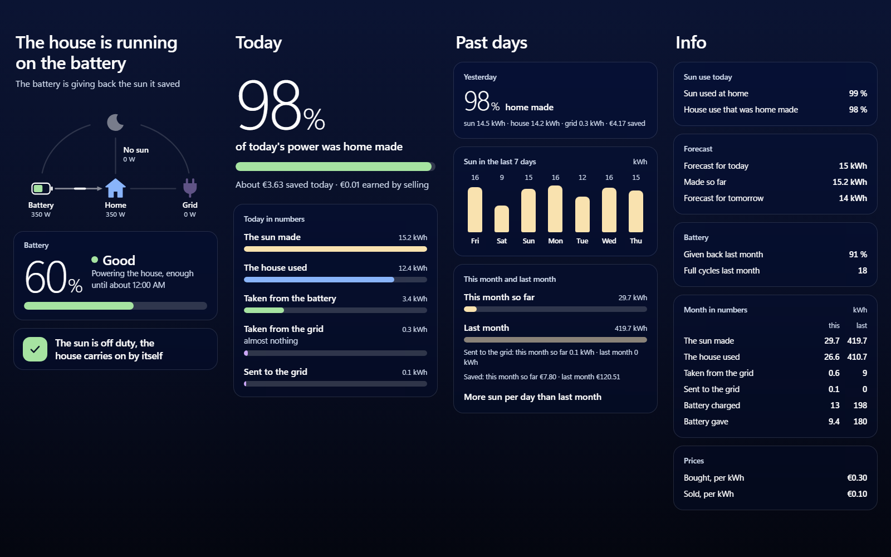
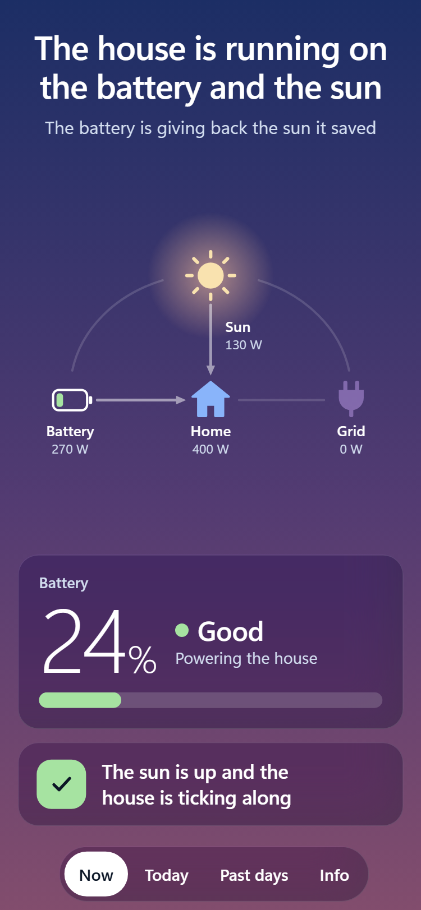
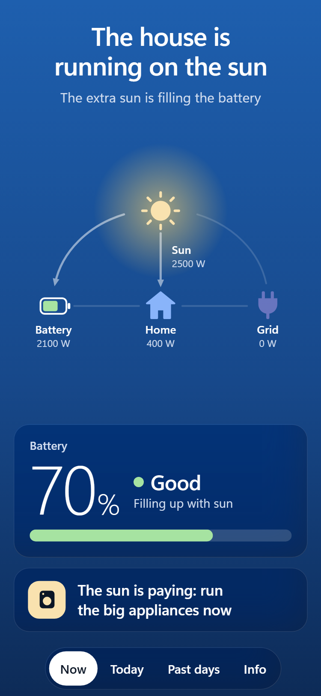
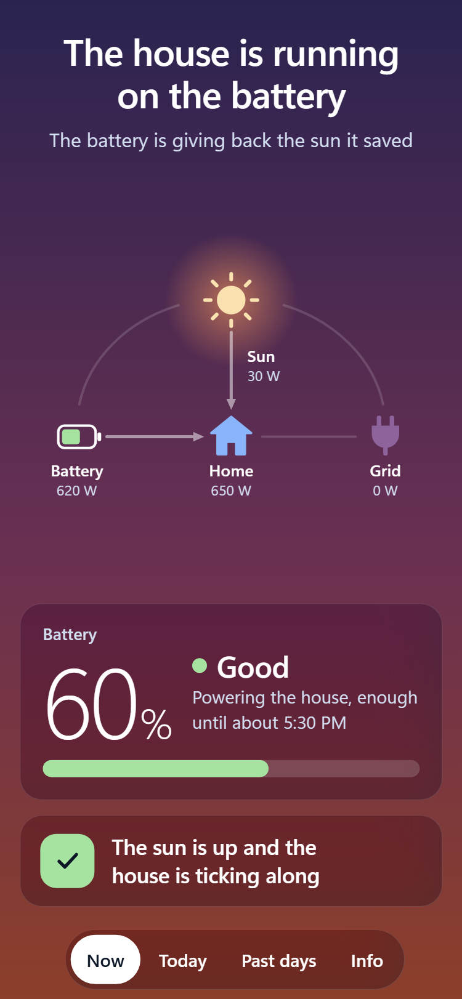
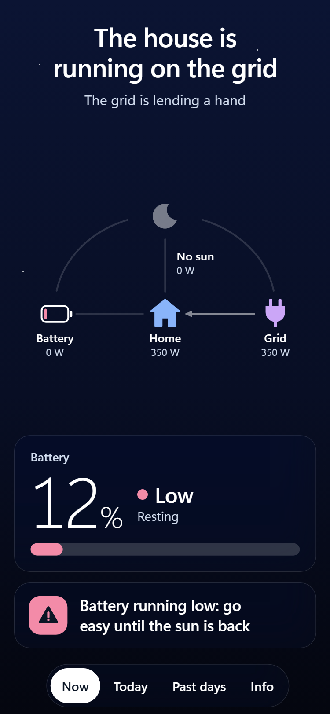

# ha-solar-view

Your solar system in plain words, as a page in Home Assistant.

Most solar dashboards are for whoever installed the system. This one is for everyone else. It says "The house is running on the sun" instead of showing watts, calls the battery "Low", "Good" or "Full" next to its percent, and gives one line of advice that follows the moment: "The sun is paying: run the big appliances now" when there is sun to spare, a warning when the battery runs low, a hint to wait when tomorrow looks sunnier. You can add [advice lines of your own](docs/setup.md#your-own-advice-lines).

Any brand works, because it reads Home Assistant's own Energy settings. One page to swipe on a phone, four columns on a wide screen, light and dark. Three simple pages for the family, a fourth with the technical numbers for admins. 8 languages (en, it, es, fr, de, pt, nl, pl), following each user's profile.

Three files, no build step, no dependencies. No data leaves your Home Assistant.



The sky at dawn, midday, dusk and night:

<p>
  
  
  
  
</p>

[All screenshots](docs/screenshots.md)

## Quick start

1. Copy the `solar-view` folder into `config/www/`.
2. Add to `configuration.yaml`:

   ```yaml
   panel_custom:
     - name: solar-view
       url_path: solar
       sidebar_title: Solar
       sidebar_icon: mdi:solar-power-variant
       module_url: /local/solar-view/solar-view.js?v=1
   ```

3. Restart Home Assistant.

You need the Energy dashboard set up with a power sensor for solar and grid. Details, options and troubleshooting are in the [setup guide](docs/setup.md).

## More

- [Setup guide](docs/setup.md): requirements, options, your own advice lines, updating, limits.
- [Screenshots](docs/screenshots.md): every page, light and dark, phone and desktop.
- [Development](docs/development.md): the preview tool, its checks, adding a language.

Translations other than Italian were not checked by a native speaker. Corrections are welcome.

## Licence

MIT, see [LICENSE](LICENSE). Accent colours from [Catppuccin](https://github.com/catppuccin/catppuccin).
