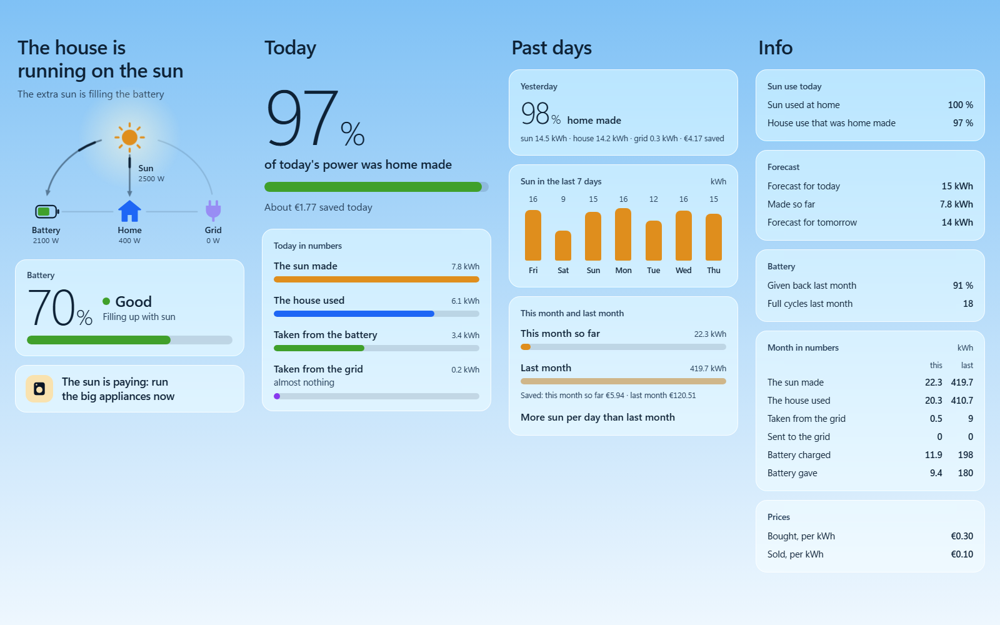
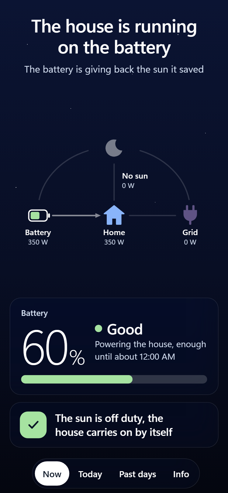
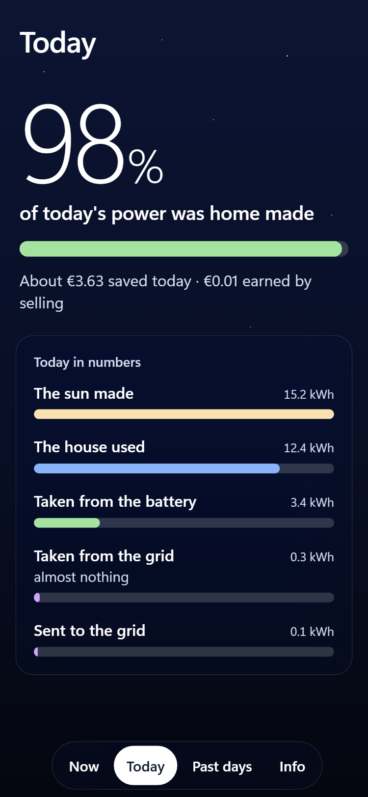
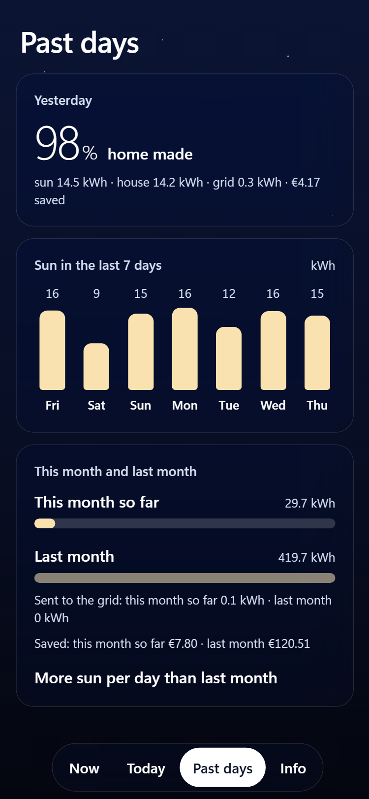
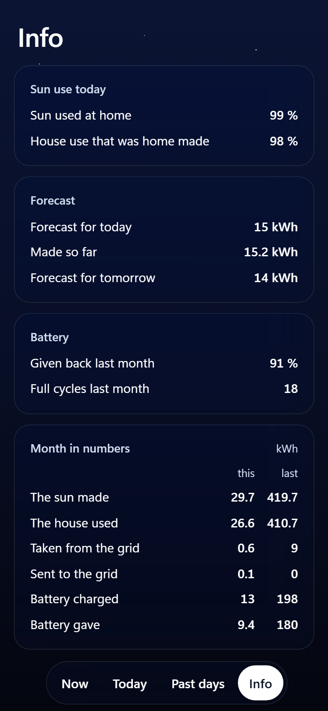
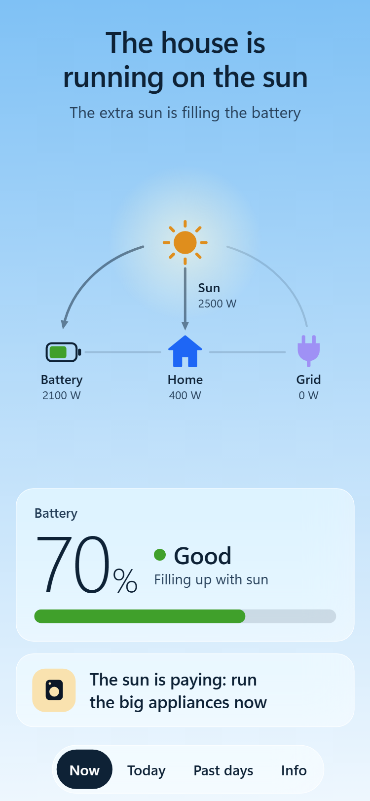
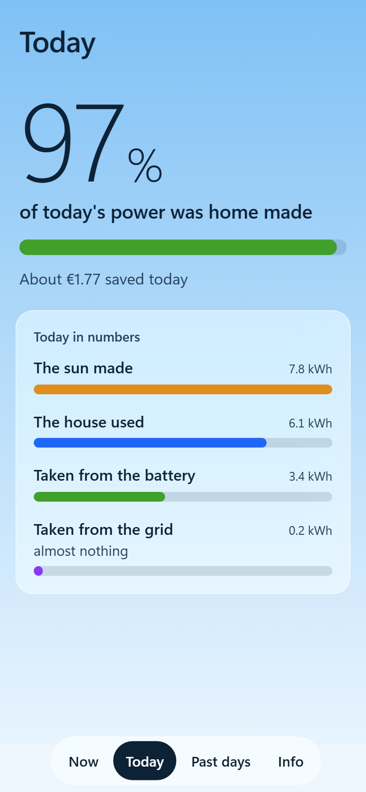
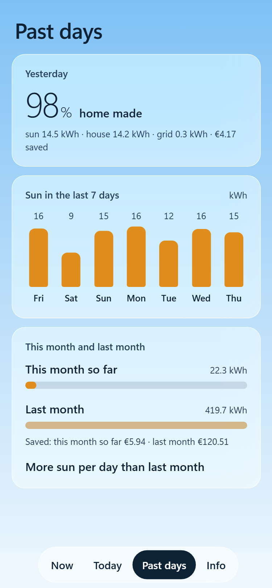
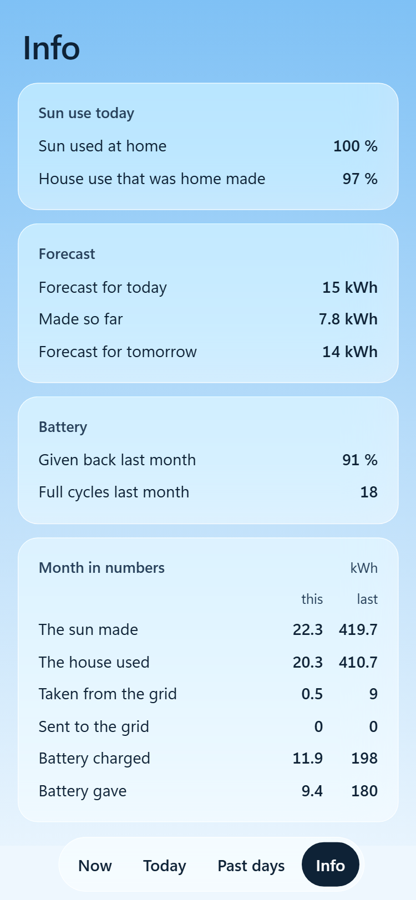

# Screenshots

All taken from the [preview tool](development.md) with made-up numbers.

## Desktop

On a wide screen the four pages stand side by side.

## Phone, dark theme

  
  
  
  

## Phone, light theme

  
  
  
  

The Info page is shown to admin users only.

## The sky

The sky is not part of the theme: it follows the real height of the sun. The same dark theme at dawn, midday, dusk and night:

  
  
  
  

